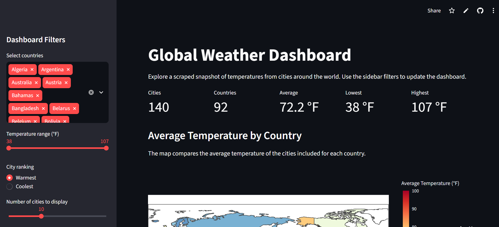

# Web-Scraping-Capstone-Project
Second Capstone project for CTD's Python Essentials 26.3
# Global Weather Scraping Dashboard

## Project Overview

This project collects weather information for cities around the world and displays it in an interactive dashboard. Users can filter the data and compare temperatures across different cities and countries.

Live dashboard:
https://karen-losoya-global-weather-dashboard.streamlit.app/

## Data Pipeline

1. `scrape_weather.py` retrieves city, country, local time, and temperature data with Selenium.
2. The unmodified results are saved in `weather_raw.csv`.
3. The data is cleaned and transformed into `weather_clean.csv`.
4. `load_weather.py` stores the raw and cleaned datasets in separate SQLite tables inside `weather.db`.
5. `streamlit_app.py` reads the cleaned SQLite table and displays the results in an interactive dashboard.

## Dashboard Features

The dashboard includes:

* Summary metrics for cities, countries, average temperature, lowest temperature, and highest temperature
* A choropleth map comparing average temperatures by country
* A histogram showing the distribution of city temperatures
* A ranked bar chart for the warmest or coolest cities
* Country, temperature-range, ranking, and city-count controls
* An expandable table containing the filtered weather records

## Dashboard Screenshot



## Project Files

* `scrape_weather.py` — Scrapes the source website and creates the CSV datasets
* `load_weather.py` — Loads the raw and cleaned datasets into SQLite
* `streamlit_app.py` — Runs the interactive dashboard
* `weather_raw.csv` — Original scraped records
* `weather_clean.csv` — Cleaned and transformed records
* `weather.db` — SQLite database containing raw and cleaned tables
* `requirements.txt` — Lists the required Python packages
* `service_urls.txt` — Contains the public Streamlit deployment URL

## Local Setup

Clone the repository and move into its directory:

```bash
git clone https://github.com/Edith56533/Web-Scraping-Capstone-Project.git
cd Web-Scraping-Capstone-Project
```

Create and activate a virtual environment:

```bash
python -m venv .venv
source .venv/Scripts/activate
```

Install the dependencies:

```bash
pip install -r requirements.txt
```

Run the dashboard using the included database:

```bash
streamlit run streamlit_app.py
```

To rebuild the data, make sure Google Chrome is installed and run:

```bash
python scrape_weather.py
python load_weather.py
```

Then restart the Streamlit dashboard.

## Data Source

Weather information was collected from the [Timeanddate.com world weather page](https://www.timeanddate.com/weather/).

## Limitations

The project represents a single scraped weather snapshot rather than a continuously updated historical dataset. The available cities are determined by the source page, so geographic coverage is uneven. Temperatures and local times can also change immediately after collection. The dashboard should therefore be treated as a collected snapshot, not a live forecast.
